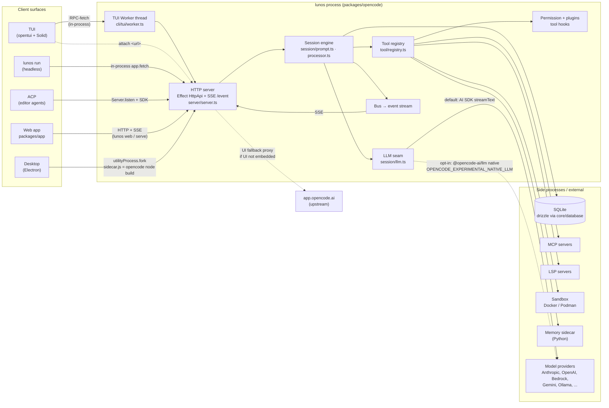
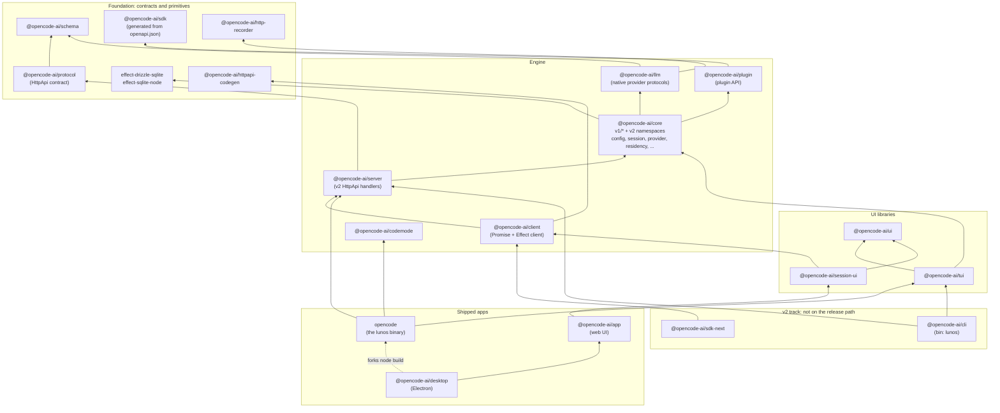
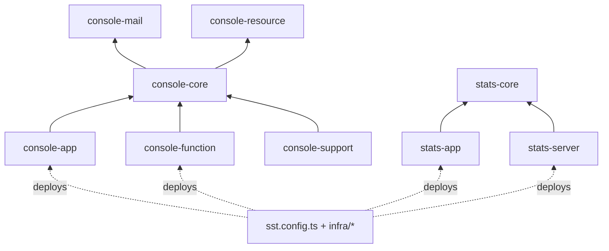
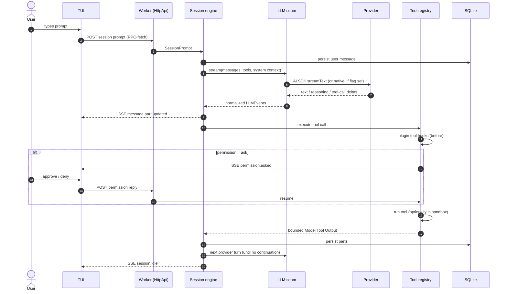

# Lunos Architecture

Lunos is a fork of [opencode](https://github.com/anomalyco/opencode). It is a Bun/TypeScript monorepo (Turbo workspaces, Effect 4, SolidJS) that ships one CLI/TUI binary plus a desktop app. Most packages keep upstream's `@opencode-ai/*` names to keep the merge surface with upstream small. See [Review findings](#review-findings).

> Snapshot of `dev` at `8bad12241f` (2026-10-02). Every arrow below was traced to the file cited next to it. Claims that come from project notes and were not re-verified in code are marked _(from notes)_.

## 1. Runtime view: what runs where

Key facts behind the diagram:

| Edge                        | Evidence                                                                                                                                                                                                                                                    |
| --------------------------- | ----------------------------------------------------------------------------------------------------------------------------------------------------------------------------------------------------------------------------------------------------------- |
| TUI ↔ server in a Worker   | `packages/opencode/src/cli/cmd/tui.ts:26,282` creates a `Worker` and a `fetch` that tunnels over RPC                                                                                                                                                        |
| Server is Effect `HttpApi`  | `packages/opencode/src/server/server.ts:6-13`. Routes live in `server/routes/instance/httpapi/handlers/*`                                                                                                                                                   |
| Events are SSE              | `packages/opencode/src/server/routes/instance/httpapi/handlers/event.ts:9` (`effect/unstable/encoding/Sse`)                                                                                                                                                 |
| LLM default vs native       | `packages/opencode/src/session/llm.ts:224-277`, flag in `src/effect/runtime-flags.ts:58`                                                                                                                                                                    |
| Desktop sidecar             | `packages/desktop/src/main/index.ts:68` defaults to `v1`. `server.ts` forks `sidecar.js`, which imports `virtual:opencode-server` and resolves to `packages/opencode` `dist/node.js` (`electron.vite.config.ts:71`)                                         |
| Desktop v2 sidecar (opt-in) | `OPENCODE_SIDECAR_V2=1` runs `opencode-cli service start` (`desktop/src/main/background-cli.ts:44`). That binary is downloaded from npm `@opencode-ai/cli-*@0.0.0-next-16350` (`desktop/scripts/utils.ts:6,77`), which is published by upstream maintainers |
| `run` / ACP use the server  | `cli/cmd/run.ts:975` calls `Server.Default().app.fetch` in-process. `cli/cmd/acp.ts:25-27` runs `Server.listen` and then `createOpencodeClient`                                                                                                             |
| Web UI source               | The release build embeds `packages/app` as `opencode-web-ui.gen.ts` (`script/build.ts:55,207`). Without it, `server/shared/ui.ts:9,85` proxies to `https://app.opencode.ai`                                                                                 |
| Storage                     | `packages/core/src/database/database.ts:3` (`@opencode-ai/effect-drizzle-sqlite`)                                                                                                                                                                           |

## 2. Package layers (shipped product)

Edges are transitively reduced. If A→B→C, the A→C edge is omitted. Dashed edges are runtime or build links, not `package.json` dependencies.

Peripheral packages not shown: `web` (Astro/Starlight docs site; `opencode` dependency), `slack` (bot on `sdk`), `storybook` (on `session-ui`), `enterprise` (on `core` + `session-ui`), `function`, `eval` (`@lunos/eval`), and `script`.

### Upstream cloud (inherited, SST/AWS + Cloudflare)

All recent commits under `infra/` and `sst.config.ts` are upstream merges, such as `#48309`. The repo has no evidence that Lunos deploys these.

## 3. Request flow: prompt → tool call → permission → UI

## 4. Where the Lunos additions live

Lunos-authored features are mostly additive directories on the **v1** path in `packages/opencode/src`, plus a few `core` modules. Each row's first commit is an XCOD ticket (`git log --diff-filter=A`):

| Feature                                 | Location                                                                                  |
| --------------------------------------- | ----------------------------------------------------------------------------------------- |
| Sandboxed runs (Docker/Podman, egress)  | `opencode/src/sandbox/` · docs: `docs/sandboxed-runs.md`                                  |
| Memory (Python sidecar, recall/notes)   | `opencode/src/memory/`                                                                    |
| Audit log + forwarding                  | `opencode/src/audit/` · `core/src/audit.ts` · docs: `docs/audit-log.md`                   |
| Marketplace (install/review/guard)      | `opencode/src/marketplace/` · `core/src/marketplace.ts` · root `marketplace/`             |
| Data residency / jurisdiction / offline | `core/src/residency.ts`, `jurisdiction.ts`, `offline.ts` · docs: `docs/data-residency.md` |
| Config policy                           | `opencode/src/config/policy.ts` (loaded first in `src/index.ts:4`)                        |
| Dev-cycle mode                          | `opencode/src/session/dev-cycle.ts`                                                       |

## Review findings

Severity is about architectural risk, not code quality. "Trade-off" marks things that look deliberate.

| #   | Severity | Finding                                                                                                                                                                                                                                                                                                                                                                                                                                                                                                          | Evidence                                                                                                                              |
| --- | -------- | ---------------------------------------------------------------------------------------------------------------------------------------------------------------------------------------------------------------------------------------------------------------------------------------------------------------------------------------------------------------------------------------------------------------------------------------------------------------------------------------------------------------- | ------------------------------------------------------------------------------------------------------------------------------------- |
| 1   | **High** | **The root `CLAUDE.md` is half wrong.** Its agent-fleet sections match `.claude/` (39 agents, 7 skills). Its "Repository Purpose" and "Technology Stack" sections describe a .NET/Angular/SQL Server project. Every Claude session loads it first and gets the wrong stack and commands. `AGENTS.md` and `CONTEXT.md` are accurate.                                                                                                                                                                              | `CLAUDE.md` "Repository Purpose" / "Technology Stack" vs `package.json`                                                               |
| 2   | **High** | **Two runtimes coexist, and only v1 is live.** The binary's session/provider path is v1 (`packages/opencode` + `core/v1/*`), even though its HTTP layer already uses the v2 `HttpApi` and `@opencode-ai/server`. Features built only against v2 session/hook APIs can ship without ever executing. This happened with residency hooks _(from notes: XCOD-93)_. The split runs **through** `core`, not between packages.                                                                                          | `session/llm.ts:3-5` imports `core/v1/permission`, `@/provider/provider`, `core/v1/session`. `opencode` imports `core/v1/session` 29× |
| 3   | **High** | **Lunos features sit on the path upstream is migrating away from.** Upstream is building v2 (`core` session, `cli`, `sdk-next`, desktop "v2 sidecar"). When upstream retires v1, sandbox, memory, audit, marketplace and policy will all need porting at once. This is an inference from the code layout, not a dated upstream plan. Treat it as a planning risk.                                                                                                                                                | §4 table; `desktop/src/main/index.ts:68,339`                                                                                          |
| 4   | Medium   | **Two LLM runtimes.** AI SDK `streamText` is the default. The `@opencode-ai/llm` native runtime is opt-in and silently falls back. Provider fixes may need to be made twice, and behaviour differs by flag.                                                                                                                                                                                                                                                                                                      | `session/llm.ts:224-267`, `runtime-flags.ts:58`                                                                                       |
| 5   | Medium   | **The desktop v2 sidecar runs upstream's binary, not Lunos.** `predev` and the dev-channel `prebuild` download `@opencode-ai/cli-*@0.0.0-next-16350` from npm. npm lists the maintainers as upstream's `thdxr` and `adamelmore`. Dev-channel installers then **ship** that binary via `extraResources`, and `OPENCODE_SIDECAR_V2=1` runs it. That build has none of the Lunos controls (sandbox, residency, audit, policy). It is off by default, and it is a third-party binary pinned by version, not by hash. | `desktop/scripts/utils.ts:6,72-80`, `prebuild.ts:11`, `predev.ts:9`, `electron-builder.config.ts:53-61`                               |
| 6   | Medium   | **Large inherited surface Lunos doesn't operate.** `console/*`, `stats/*`, `enterprise`, `infra/` and `sst.config.ts` are about 370 TS files that still cost typecheck, CI and merge-conflict time. _Trade-off:_ deleting them would increase conflicts on every upstream merge _(from notes: merge, never rebase)_.                                                                                                                                                                                             | `infra/` git log contains only upstream commits                                                                                       |
| 7   | Medium   | **Probable bug (unconfirmed): offline mode disables the _local_ web UI.** `disableEmbeddedWebUi` is `orOffline(...)`, so `LUNOS_OFFLINE=1` makes `embeddedUI()` return `null`. `serveUIEffect` then falls through to the `app.opencode.ai` proxy, which has no offline check of its own. The result is either a broken `lunos web` offline or an outbound call the egress catalogue says is blocked. Confirm with a release binary: `LUNOS_OFFLINE=1 lunos serve`, then request `/` and watch egress.            | `effect/runtime-flags.ts:24`, `server/shared/ui.ts:44-45,83-90`, `core/src/offline.ts:120-126`                                        |
| 8   | Low      | **Mixed naming.** The workspace is `@opencode-ai/*`, the package is `opencode` with bin `opencode`, while `@opencode-ai/cli` has bin `lunos`, and `CONTEXT.md` says "OpenCode". _Trade-off:_ keeping upstream names minimizes the merge surface. A short naming note in `AGENTS.md` would stop agents from "fixing" it.                                                                                                                                                                                          | `packages/opencode/package.json`, `packages/cli/package.json`                                                                         |

**Strengths worth preserving**

- **Contract-first API.** `protocol` defines the `HttpApi`. `openapi.json` → `sdk`, and `httpapi-codegen` → `client`, are generated from it, so UIs track the server whenever `generate` runs.
- **Same API in-process and remote.** The TUI uses the same HTTP surface through a Worker that `attach`, web and desktop use over the network. One code path covers both local and remote use.
- **Clean foundation layer.** `schema` has no internal dependencies and everything flows upward. There are no cycles among the shipped packages.
- **Effect layers throughout.** This explains why runtime env injection must also set `Flag` fields _(from notes)_. It is worth documenting near `core/src/flag`.

## Suggested next steps

1. Rewrite the "Repository Purpose" and "Technology Stack" sections of `CLAUDE.md` to point at `AGENTS.md` and this document. Keep the agent-fleet sections. This is the cheapest and highest-value fix.
2. Add a "live-path check" to the PR template: does this change run on v1 `packages/opencode/src/session`? Prove it with a real run.
3. Track the v1→v2 porting debt per Lunos feature (finding 3) as an epic, so upstream's eventual v1 removal doesn't arrive as a surprise.
